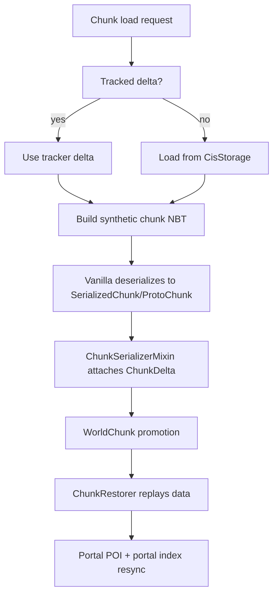

# Load And Restore Pipeline

## Problem this subsystem solves

Chunkis must load chunk data without vanilla `.mca` storage, yet still reuse vanilla deserialization and worldgen where useful. The load pipeline therefore builds synthetic chunk NBT, lets vanilla produce a `ProtoChunk`, and then restores Chunkis state around that process.

## Responsibilities

- Block vanilla region reads.
- Build synthetic load NBT rooted in Chunkis data.
- Resolve whether the source is tracker memory, storage, or neither.
- Attach decoded deltas to proto chunks.
- Restore data into live `WorldChunk` instances.
- Keep portal-related auxiliary state aligned after restore.

## What it does not do

- It does not decode raw CIS directly into a live chunk in one step.
- It does not treat generated terrain as authoritative when a persisted base snapshot exists.
- It does not silently keep stale block entities after block-grid restore.

## Owning classes

- `fabric/.../mixin/storage/StoragePreventionMixin`
- `fabric/.../mixin/storage/ThreadedAnvilChunkStorageMixin`
- `fabric/.../mixin/storage/ChunkSerializerMixin`
- `fabric/.../mixin/world/WorldChunkMixin`
- `fabric/.../world/ChunkRestorer`
- `fabric/.../storage/CisNbtUtil`

## Architecture

## Source selection

`ChunkSerializerMixin.chunkis$loadDelta(...)` uses this order:

1. `GlobalChunkTracker` memory / unload-cache state
2. `CisStorage.load(...)`
3. nothing meaningful (`NEITHER`)

This preserves newer in-memory state over older on-disk state.

## Synthetic NBT strategy

`ThreadedAnvilChunkStorageMixin.chunkis$onGetUpdatedChunkNbt(...)` creates the NBT that vanilla will deserialize.

There are two cases:

- persisted base chunk NBT exists
  Chunkis uses it as the vanilla deserialization baseline
- no persisted base chunk NBT exists
  Chunkis creates a minimal synthetic chunk root with status `minecraft:empty`

This is why load is still partly "vanilla-shaped" even though storage is not.

## Proto attach stage

`ChunkSerializerMixin` runs after vanilla converts serialized NBT into a `ProtoChunk`.

It attaches the resolved `ChunkDelta` through `ChunkisDeltaDuck` and then:

- keeps the persisted base baseline if base chunk NBT existed
- otherwise resets the proto status to `ChunkStatus.EMPTY` so terrain will regenerate before sparse replay

## Restore stage

`WorldChunkMixin` triggers restore when a `WorldChunk` is constructed from a `ProtoChunk`.

`ChunkRestorer` then:

- clears the chunk to air when no persisted base snapshot exists
- removes stale block entities
- replays blocks, block entities, and legacy entity payloads
- copies restored state into the runtime delta without marking it dirty
- marks the runtime delta saved

## Portal follow-up

Restore also has non-block follow-up work:

- rebuild portal POIs in vanilla POI storage
- update `PortalChunkIndexManager`

Those are intentionally outside core sparse replay, so failures there are traced as post-restore failures rather than hidden.

## Invariants

- If a persisted base chunk exists, Chunkis must preserve that baseline through deserialization.
- If no persisted base chunk exists, missing block entries mean regenerate first, then replay.
- Restore must not turn replay into a new dirty mutation.
- Stale block entities must be removed when restored block state no longer supports them.

## Common debugging locations

- [StoragePreventionMixin.java](C:/Users/Liparakis/Desktop/Chunkis/fabric/src/main/java/io/liparakis/chunkis/mixin/storage/StoragePreventionMixin.java)
- [ThreadedAnvilChunkStorageMixin.java](C:/Users/Liparakis/Desktop/Chunkis/fabric/src/main/java/io/liparakis/chunkis/mixin/storage/ThreadedAnvilChunkStorageMixin.java)
- [ChunkSerializerMixin.java](C:/Users/Liparakis/Desktop/Chunkis/fabric/src/main/java/io/liparakis/chunkis/mixin/storage/ChunkSerializerMixin.java)
- [WorldChunkMixin.java](C:/Users/Liparakis/Desktop/Chunkis/fabric/src/main/java/io/liparakis/chunkis/mixin/world/WorldChunkMixin.java)
- [ChunkRestorer.java](C:/Users/Liparakis/Desktop/Chunkis/fabric/src/main/java/io/liparakis/chunkis/world/ChunkRestorer.java)

## Common failure modes

- storage decode or decompression failure causing an entry clear
- restore skipped because a block-entity-only sparse payload had no base snapshot
- restore succeeds but portal follow-up fails later
- clean unload-cache delta being mistakenly treated as authoritative until invalidated

## See also

- [Save Pipeline](C:/Users/Liparakis/Desktop/Chunkis/docs/Architecture/Save-Pipeline.md)
- [Snapshots And Metadata](C:/Users/Liparakis/Desktop/Chunkis/docs/Architecture/Snapshots-And-Metadata.md)
- [Tracking, Guards, And Durability](C:/Users/Liparakis/Desktop/Chunkis/docs/Architecture/Tracking-Guards-And-Durability.md)
