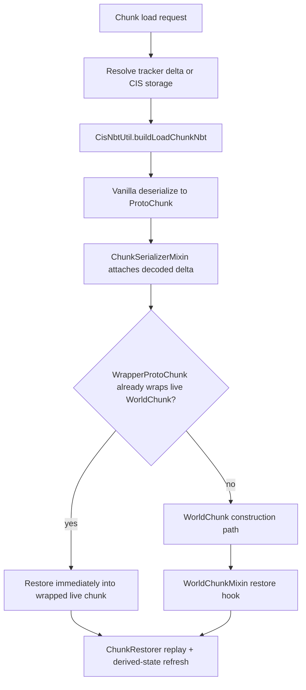

# Load And Restore Pipeline

## Purpose

Chunkis must load chunk state without reading vanilla region data, while still reusing vanilla deserialization where
that is safer than decoding directly into a live chunk.

## Main Classes

- `fabric/src/main/java/io/liparakis/chunkis/mixin/storage/StoragePreventionMixin.java`
- `fabric/src/main/java/io/liparakis/chunkis/mixin/storage/ThreadedAnvilChunkStorageMixin.java`
- `fabric/src/main/java/io/liparakis/chunkis/mixin/storage/ChunkSerializerMixin.java`
- `fabric/src/main/java/io/liparakis/chunkis/mixin/world/chunk/WorldChunkMixin.java`
- `fabric/src/main/java/io/liparakis/chunkis/world/restoration/core/ChunkRestorer.java`
- `fabric/src/main/java/io/liparakis/chunkis/world/restoration/nbt/CisNbtUtil.java`

## Pipeline

## Source Resolution

`ThreadedAnvilChunkStorageMixin#chunkis$resolveDeltaForLoad(...)` prefers sources in this order:

1. tracked in-memory delta
2. unload-cache delta
3. CIS storage
4. no Chunkis state

If a tracked dirty delta exists, Chunkis can synchronously flush it before building synthetic load NBT so storage and
memory do not drift during load.

## Synthetic NBT

`CisNbtUtil.buildLoadChunkNbt(...)` chooses between:

- a persisted base chunk NBT baseline
- a synthetic empty-shell chunk root

The base chunk is used only when metadata says it should be the block baseline. Full-baseline CIS snapshots do not use
persisted base chunk blocks during load.

## Proto Attach Stage

`ChunkSerializerMixin` attaches the decoded `ChunkDelta` to the proto chunk through `ChunkisDeltaDuck`.

It also preserves the base-baseline decision:

- base-backed loads keep the relevant metadata attached
- baseline-free loads keep the proto ready for regeneration-first restore behavior

## Restore Stage

`ChunkRestorer.restore(...)` currently:

1. clears runtime delta payloads and copies metadata/palette from the proto delta
2. decides whether a persisted base chunk already supplies the block baseline
3. clears the live chunk to air when restore must rebuild the baseline itself
4. replays blocks, block entities, and pending or legacy entity payloads
5. refreshes heightmaps and lighting
6. repopulates the runtime delta without making it dirty

For bulk restore cases, Chunkis resends a full vanilla chunk packet and then sends a fresh Chunkis delta to chunk
watchers.

## Restore-Time Safety Rules

- Block-entity-only sparse payloads without a base are rejected.
- Restore runs on the server thread.
- Restore must not become a fresh tracked player mutation.
- Derived state such as lighting and heightmaps is refreshed after raw writes.

## Portal And Entity Follow-Up

After restore, Chunkis may also:

- replay pending entities through `EntityReplayCoordinator`
- rebuild portal index state through the portal managers
- resend updated chunk state to watching players

Those are follow-up effects of restore, not separate persistence sources.

## Related Docs

- [Save Pipeline](Save-Pipeline.md)
- [Snapshots And Metadata](Snapshots-And-Metadata.md)
- [Tracking, Guards, And Durability](Tracking-Guards-And-Durability.md)
- [Networking And Client Sync](Networking-And-Client-Sync.md)
