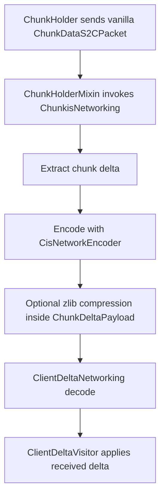

# Networking And Client Sync

## Purpose

Server-side Chunkis state is not part of vanilla chunk packets, so Chunkis sends a parallel delta payload whenever the server sends chunk data to clients.

## Main Classes

- `fabric/src/main/java/io/liparakis/chunkis/mixin/network/ChunkHolderMixin.java`
- `fabric/src/main/java/io/liparakis/chunkis/network/ChunkisNetworking.java`
- `fabric/src/main/java/io/liparakis/chunkis/network/ChunkDeltaPayload.java`
- `fabric/src/main/java/io/liparakis/chunkis/network/FabricNetworkCodecFactory.java`
- `core/src/main/java/io/liparakis/chunkis/storage/codec/network/CisNetworkEncoder.java`
- `core/src/main/java/io/liparakis/chunkis/storage/codec/network/CisNetworkDecoder.java`
- `fabric/src/main/java/io/liparakis/chunkis/client/ClientDeltaNetworking.java`
- `fabric/src/main/java/io/liparakis/chunkis/client/ClientDeltaVisitor.java`

## Pipeline

## Server-Side Rules

- Chunkis does not replace vanilla chunk packets.
- Empty deltas are skipped.
- Oversized payloads are dropped.
- One prepared payload can be fanned out to multiple players.
- Bulk restore resends can pre-encode off-thread and send back on the server thread.

## Client-Side Rules

- Payload decode happens before client-world application.
- Actual chunk mutation is scheduled onto the main client thread.
- Missing `ChunkisDeltaDuck` support on the client chunk is treated as a traced failure.

## Wire Format

`ChunkDeltaPayload` carries:

- chunk X
- chunk Z
- compression flag
- data length
- payload bytes
- original uncompressed size when compressed

Disk storage and network transport do not share the same compression layer:

- disk uses the CIS storage pipeline and Zstd
- client sync uses the network codec and optional zlib compression inside the packet payload

## Related Docs

- [Load And Restore Pipeline](Load-And-Restore-Pipeline.md)
- [Storage Format](Storage-Format.md)
- [Observability And Debugging](Observability-And-Debugging.md)
