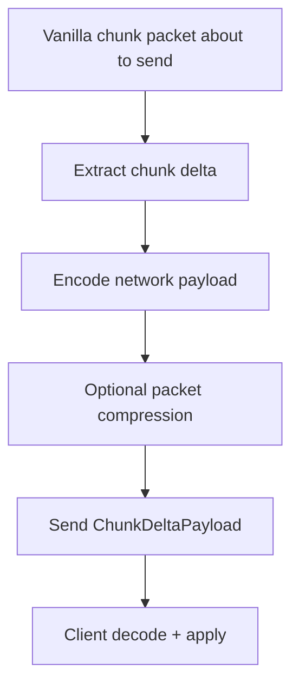

# Networking And Client Sync

## Problem this subsystem solves

Server-side Chunkis state must be replayed on clients that receive vanilla chunk packets. Chunkis therefore sends a parallel delta payload to clients whenever chunk data is sent.

## Responsibilities

- detect when a chunk has meaningful Chunkis delta state
- encode a network-specific delta payload
- send it alongside vanilla chunk data
- decode and apply it on the client
- trace top-level sync boundaries

## What it does not do

- It does not replace vanilla chunk packets.
- It does not send empty placeholder deltas.
- It does not keep a shared end-to-end cross-wire operation id yet.

## Owning classes

- `fabric/.../network/ChunkisNetworking`
- `fabric/.../network/ChunkDeltaPayload`
- `fabric/.../network/FabricNetworkCodecFactory`
- `core/.../storage/codec/network/CisNetworkEncoder`
- `core/.../storage/codec/network/CisNetworkDecoder`
- `fabric/.../client/ClientDeltaNetworking`

## Pipeline

## Entry points

- send side: `ChunkisNetworking.sendDelta(...)`
- client apply side: `ClientDeltaNetworking`
- packet registration: `ChunkisMod.registerPayloads()` and `ClientChunkisMod`

## Key rules

- empty or absent deltas are skipped
- oversized payloads are dropped
- client sync is additive to vanilla chunk transfer, not a replacement
- tracing is currently focused on top-level send/apply boundaries, not deep per-stage codec internals

## Invariants

- packet send must not happen for a null or empty delta
- network payload shape uses the network codec, not the region-file codec directly
- client decode failures must be surfaced as trace failures, not swallowed silently

## Common debugging locations

- [ChunkisNetworking.java](C:/Users/Liparakis/Desktop/Chunkis/fabric/src/main/java/io/liparakis/chunkis/network/ChunkisNetworking.java)
- [ChunkDeltaPayload.java](C:/Users/Liparakis/Desktop/Chunkis/fabric/src/main/java/io/liparakis/chunkis/network/ChunkDeltaPayload.java)
- [ClientDeltaNetworking.java](C:/Users/Liparakis/Desktop/Chunkis/fabric/src/main/java/io/liparakis/chunkis/client/ClientDeltaNetworking.java)
- [CisNetworkEncoder.java](C:/Users/Liparakis/Desktop/Chunkis/core/src/main/java/io/liparakis/chunkis/storage/codec/network/CisNetworkEncoder.java)
- [CisNetworkDecoder.java](C:/Users/Liparakis/Desktop/Chunkis/core/src/main/java/io/liparakis/chunkis/storage/codec/network/CisNetworkDecoder.java)

## Common failure modes

- payload too large and dropped
- client decode failure due to malformed or incompatible payload
- assuming network sync shares the exact same semantics as disk persistence

## See also

- [Storage Format](C:/Users/Liparakis/Desktop/Chunkis/docs/Architecture/Storage-Format.md)
- [Observability And Debugging](C:/Users/Liparakis/Desktop/Chunkis/docs/Architecture/Observability-And-Debugging.md)
