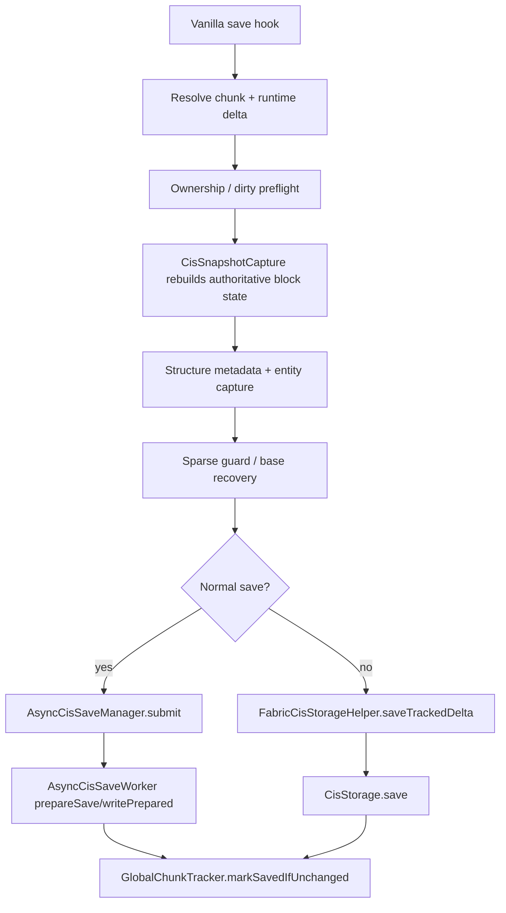

# Save Pipeline

## Purpose

Chunkis must persist chunk state without falling back to vanilla region writes, while still preventing unsafe sparse payloads from reaching disk.

## Main Classes

- `fabric/src/main/java/io/liparakis/chunkis/mixin/storage/ThreadedAnvilChunkStorageMixin.java`
- `fabric/src/main/java/io/liparakis/chunkis/world/restoration/capture/CisSnapshotCapture.java`
- `fabric/src/main/java/io/liparakis/chunkis/world/restoration/capture/BaseChunkCaptureUtil.java`
- `fabric/src/main/java/io/liparakis/chunkis/world/entity/capture/LiveEntitySnapshotCapture.java`
- `fabric/src/main/java/io/liparakis/chunkis/world/tracking/ownership/DeltaPersistenceGuard.java`
- `fabric/src/main/java/io/liparakis/chunkis/world/tracking/save/AsyncCisSaveManager.java`
- `fabric/src/main/java/io/liparakis/chunkis/world/tracking/save/AsyncCisSaveWorker.java`
- `core/src/main/java/io/liparakis/chunkis/storage/io/CisStorage.java`

## Pipeline

## What Happens On A Normal Save

`ThreadedAnvilChunkStorageMixin#chunkis$onSave` is the authoritative save hook.

The current sequence is:

1. resolve the chunk instance to save
2. resolve the attached `ChunkDelta`
3. reject clean or unowned placeholder state
4. rebuild an authoritative snapshot with `CisSnapshotCapture.capture(...)`
5. merge structure metadata and live entity payload capture where needed
6. run sparse-payload recovery and guard checks
7. queue the result through `AsyncCisSaveManager.submit(...)`

The important part is step 4: normal persistence is snapshot-based, not just "write whatever incremental live edits are currently attached."

## Snapshot Rules

`CisSnapshotCapture` currently does two different things:

- if the chunk has block entities, it captures a persisted base chunk through `BaseChunkCaptureUtil.captureBaseChunk(...)`
- otherwise it clears block payloads and rebuilds a full authoritative block baseline directly into the delta

That means the save path is deliberately conservative around block entities and restore safety.

## Sparse Guard And Recovery

`DeltaPersistenceGuard` rejects payloads that still have replay content but have neither:

- persisted base chunk NBT
- full block baseline metadata

Before rejecting, the save hook attempts recovery through `BaseChunkCaptureUtil` when a live `WorldChunk` is still available.

## Async Save Model

`AsyncCisSaveManager` snapshots the live delta on the server thread and hands it to a per-dimension `AsyncCisSaveWorker`.

`AsyncCisSaveWorker`:

1. checks that the queued delta generation is still current
2. caches encoded chunk metadata when needed
3. runs `CisStorage.prepareSave(...)`
4. re-checks generation freshness
5. runs `CisStorage.writePrepared(...)`
6. marks the live delta saved only if the same delta instance and generation are still current

This is the main stale-write protection in the current implementation.

## Synchronous Save Paths

Chunkis still saves synchronously in a few cases:

- dirty-delta flush during the load path
- shutdown safety sweeps
- final force-save passes when normal async completion did not happen in time

Those paths still go through the same persistence guard logic.

## Invariants

- Chunkis does not keep vanilla `.mca` writes as a safety fallback.
- Empty deltas clear the CIS entry instead of writing fake payloads.
- Async completion must never mark a newer generation clean.
- Save-time snapshot capture can rewrite the delta shape before persistence.

## Related Docs

- [Delta And Ownership Model](Delta-And-Ownership-Model.md)
- [Snapshots And Metadata](Snapshots-And-Metadata.md)
- [Tracking, Guards, And Durability](Tracking-Guards-And-Durability.md)
- [Storage Format](Storage-Format.md)
