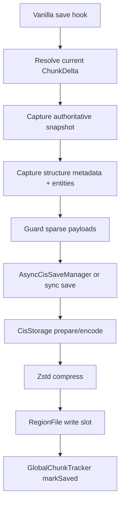

# Save Pipeline

## Problem this subsystem solves

Chunkis needs to persist chunk state without relying on vanilla `.mca` writes, while preserving enough information to reload safely after terrain generation, async saves, and migration.

## Responsibilities

- Intercept vanilla save requests.
- Capture authoritative chunk state.
- Validate whether the payload is safe to persist.
- Encode, compress, and write the payload to the correct CIS region slot.
- Keep dirty tracking and async-save completion coherent.

## What it does not do

- It does not let vanilla region storage remain a fallback path.
- It does not persist arbitrary sparse deltas blindly.
- It does not perform base capture on every path by default; that is done only when needed.

## Owning classes

- `fabric/.../mixin/storage/ThreadedAnvilChunkStorageMixin`
- `fabric/.../storage/CisSnapshotCapture`
- `fabric/.../storage/AsyncCisSaveManager`
- `fabric/.../storage/BaseChunkCaptureUtil`
- `fabric/.../storage/BaseChunkCaptureScheduler`
- `fabric/.../storage/DeltaPersistenceGuard`
- `core/.../storage/io/CisStorage`
- `core/.../storage/io/RegionFile`

## Architecture

## Normal save path

`ThreadedAnvilChunkStorageMixin.chunkis$onSave(...)` is the main save hook.

Sequence:

1. Resolve the chunk and current delta.
2. Skip if Chunkis does not own meaningful state.
3. Rebuild the delta with `CisSnapshotCapture.capture(...)`.
4. Merge structure metadata and current entity payloads.
5. Queue the result through `AsyncCisSaveManager.submit(...)`.
6. Return `true` and suppress vanilla save behavior.

The key design choice is step 3. The normal save path persists an authoritative snapshot, not the incremental live mutation shape.

## Synchronous save paths

Chunkis still uses direct synchronous saves in a few places:

- load-path flush of a dirty tracked delta before synthetic load NBT is built
- shutdown safety sweeps
- direct base capture persistence in `BaseChunkCaptureUtil.captureAndPersistBaseChunkIfMissing(...)`

These paths all end in `CisStorage.save(...)`.

## Async save path

`AsyncCisSaveManager` snapshots the live delta, coalesces queued saves per chunk, then writes on a per-dimension worker thread.

Important details:

- encoding-sensitive live state is snapshotted on the server thread
- compression and file I/O happen on the worker thread
- stale generations are ignored
- successful completion only marks the live delta saved if the generation still matches

## Base capture during save

`BaseChunkCaptureUtil` and `BaseChunkCaptureScheduler` exist for safety, not as the main save shape.

They are used when Chunkis detects that a sparse replay payload would be unsafe without a persisted baseline. In that case Chunkis can:

- capture base chunk NBT immediately
- persist it synchronously
- or defer the capture and flush it later

## Invariants

- Vanilla `.mca` writes are always cancelled.
- A queued async save must not mark a newer generation clean.
- Sparse replay payloads without a persistence anchor must be rejected or repaired before write.
- Empty deltas are encoded as chunk-entry clears in storage, not as meaningless payloads.

## Common debugging locations

- [ThreadedAnvilChunkStorageMixin.java](C:/Users/Liparakis/Desktop/Chunkis/fabric/src/main/java/io/liparakis/chunkis/mixin/storage/ThreadedAnvilChunkStorageMixin.java)
- [AsyncCisSaveManager.java](C:/Users/Liparakis/Desktop/Chunkis/fabric/src/main/java/io/liparakis/chunkis/storage/AsyncCisSaveManager.java)
- [BaseChunkCaptureUtil.java](C:/Users/Liparakis/Desktop/Chunkis/fabric/src/main/java/io/liparakis/chunkis/storage/BaseChunkCaptureUtil.java)
- [BaseChunkCaptureScheduler.java](C:/Users/Liparakis/Desktop/Chunkis/fabric/src/main/java/io/liparakis/chunkis/storage/BaseChunkCaptureScheduler.java)
- [CisStorage.java](C:/Users/Liparakis/Desktop/Chunkis/core/src/main/java/io/liparakis/chunkis/storage/io/CisStorage.java)
- [RegionFile.java](C:/Users/Liparakis/Desktop/Chunkis/core/src/main/java/io/liparakis/chunkis/storage/io/RegionFile.java)

## Common failure modes

- save rejected because the payload is sparse and has no base
- stale async completion ignored because the delta mutated again
- storage write failure after encode/compress
- shutdown flush finding dirty deltas that never made it through the normal path

## See also

- [Delta And Ownership Model](C:/Users/Liparakis/Desktop/Chunkis/docs/Architecture/Delta-And-Ownership-Model.md)
- [Snapshots And Metadata](C:/Users/Liparakis/Desktop/Chunkis/docs/Architecture/Snapshots-And-Metadata.md)
- [Storage Format](C:/Users/Liparakis/Desktop/Chunkis/docs/Architecture/Storage-Format.md)
- [Tracking, Guards, And Durability](C:/Users/Liparakis/Desktop/Chunkis/docs/Architecture/Tracking-Guards-And-Durability.md)
