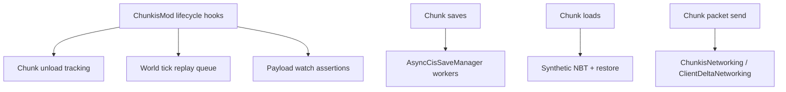

# Startup And Lifecycle

## Purpose

This document maps the actual startup, steady-state, and shutdown lifecycle in the current codebase.

## Startup Sequence

### Common initialization

`ChunkisMod.onInitialize()` does four things:

1. registers `ChunkDeltaPayload`
2. registers server commands
3. registers chunk/world/server lifecycle callbacks
4. logs hot-path metrics status when enabled

### Client initialization

`ClientChunkisMod.onInitializeClient()`:

1. registers client delta networking handlers
2. installs a migration-status listener that can surface blocking offline migration progress in the client UI
3. logs client metrics status

### Prelaunch migration

The current offline MCA-to-CIS translation flow is coordinated by `PreLaunchMigrationCoordinator`. It runs before integrated-server startup continues, scans dimension storage layout, and:

- treats existing CIS plus retired `.mca.backup` files as authoritative
- deletes stale live `.mca` files once CIS has already taken over
- otherwise translates vanilla `.mca` regions through `OfflineMcaCisTranslator`

This is separate from CIS version upgrades in `cismigrator`.

## Steady-State Runtime

Key steady-state services:

- `GlobalChunkTracker`
- `AsyncCisSaveManager` and `AsyncCisSaveWorker`
- `ScheduledEntityReplayQueue`
- `PortalChunkIndexManager`
- `PortalLinkManager`
- `PayloadWatchTracer`

## Shutdown Sequence

There are two shutdown paths in the code today.

### Server lifecycle shutdown

`ChunkisMod.flushBeforeServerStop(...)` runs while worlds are still available. For each world it:

1. force-saves pending dirty deltas
2. flushes and closes async save workers
3. closes portal chunk index state

Then it closes global portal links and runs final payload-watch assertions.

`ChunkisMod.clearRuntimeState()` runs after stop and clears static runtime state for:

- `GlobalChunkTracker`
- `AsyncCisSaveManager`
- `PortalChunkIndexManager`
- `PortalLinkManager`
- `ScheduledEntityReplayQueue`
- `MigrationProgressTracker`

### Chunk loading manager close hook

`ThreadedAnvilChunkStorageMixin#chunkis$onClose` also performs a final force-save sweep, closes the world async-save worker, and closes world storage. This keeps the storage hook self-contained even if the chunk-loading manager is being torn down directly.

## Threading Boundaries

- Live chunk mutation, snapshot capture, restore, and tracker mutation are server-thread work.
- `AsyncCisSaveManager` snapshots the delta on the server thread.
- `AsyncCisSaveWorker` performs encode preparation completion checks, compression, and disk writes off-thread.
- Client delta application is scheduled onto the main client thread by `ClientDeltaNetworking`.

## Limitations

- The blocking prelaunch MCA translator is implemented for the integrated-server startup flow reflected by `PreLaunchMigrationCoordinator`.
- Shutdown correctness still depends on final synchronous safety sweeps when async work remains outstanding.

## Related Docs

- [Save Pipeline](Save-Pipeline.md)
- [Load And Restore Pipeline](Load-And-Restore-Pipeline.md)
- [Migration And Versioning](Migration-And-Versioning.md)
