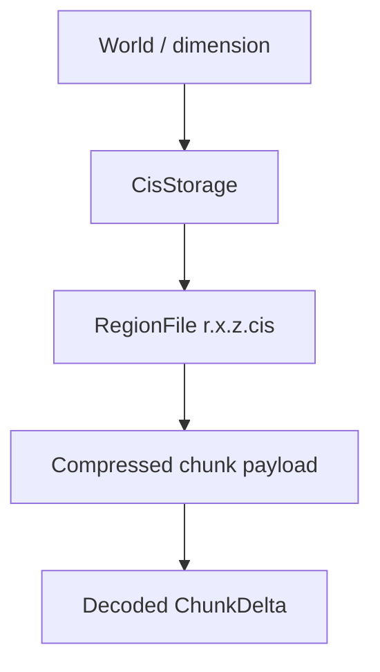

# Storage Format

## Problem this subsystem solves

Chunkis needs a chunk storage format that is independent of vanilla region files, supports global block-id portability, allows multiple section encodings, and remains writable under concurrent save/load activity.

## Responsibilities

- Store per-dimension chunk data under `chunkis/regions/`.
- Maintain a per-dimension `global_ids.json` block-id mapping.
- Encode/decode `ChunkDelta` values into CIS bytes.
- Compress payloads with Zstd.
- Store payloads in region files with reusable free-space accounting.
- Support compaction and storage inspection.

## What it does not do

- It does not share data with vanilla `.mca` region files.
- It does not use one fixed section encoding.
- It does not rely on file append only; region slots can be reused and compacted.

## Owning classes

- `core/.../storage/io/CisStorage`
- `core/.../storage/io/RegionFile`
- `core/.../storage/codec/*`
- `core/.../storage/mapping/CisMapping`
- `fabric/.../storage/FabricCisStorageHelper`
- `core/.../storage/io/CisRegionInspector`
- `core/.../storage/io/CisRegionCompactor`

## On-disk layout

```text
<world>/
  chunkis/
    global_ids.json
    regions/
      r.<regionX>.<regionZ>.cis
```

Non-overworld dimensions use the mirrored dimension path under `dimensions/<namespace>/<path>/chunkis/`.

## Data ownership chain



## Encoding pipeline

1. `ChunkDelta` is converted into encoder-friendly section state.
2. `CisMapping` assigns stable global block ids using `global_ids.json`.
3. `CisEncoder` writes:
   - header
   - global palette
   - section payloads
   - block entities
   - entities
   - chunk metadata
4. `CompressionContext` compresses with Zstd.
5. `RegionFile` writes the compressed blob into a chunk slot.

## Section encodings

The encoder/decoder supports multiple section shapes:

- uniform
- default-sparse
- sparse
- dense

This is why storage analysis code spends time reporting section mixes. CIS is explicitly not one rigid "always sparse" format anymore.

## Mapping model

`CisMapping` is append-only from the point of view of numeric ids:

- known blocks keep their ids
- removed blocks stay reserved as unresolved tombstones
- new blocks append

That is what makes saved CIS payloads portable across installations that still share the same logical block identifiers.

## Region file layout

`RegionFile` stores:

- fixed 8192-byte header for 1024 chunk slots
- live payload area
- optional allocation metadata footer

Free space is tracked as reusable blocks. Writes prefer:

1. in-place reuse
2. best-fit hole reuse
3. append

Compaction rewrites live entries contiguously into a temp file and swaps it in.

## Invariants

- `global_ids.json` is dimension-local and must be flushed before writes that depend on new ids.
- Region header offsets must always point inside the live payload area.
- Free blocks are normalized, sorted, and non-overlapping.
- Empty deltas clear the region entry rather than writing a fake payload.

## Common debugging locations

- [CisStorage.java](C:/Users/Liparakis/Desktop/Chunkis/core/src/main/java/io/liparakis/chunkis/storage/io/CisStorage.java)
- [RegionFile.java](C:/Users/Liparakis/Desktop/Chunkis/core/src/main/java/io/liparakis/chunkis/storage/io/RegionFile.java)
- [CisMapping.java](C:/Users/Liparakis/Desktop/Chunkis/core/src/main/java/io/liparakis/chunkis/storage/mapping/CisMapping.java)
- [AbstractCisEncoder.java](C:/Users/Liparakis/Desktop/Chunkis/core/src/main/java/io/liparakis/chunkis/storage/codec/AbstractCisEncoder.java)
- [AbstractCisDecoder.java](C:/Users/Liparakis/Desktop/Chunkis/core/src/main/java/io/liparakis/chunkis/storage/codec/AbstractCisDecoder.java)
- [CompressionContext.java](C:/Users/Liparakis/Desktop/Chunkis/core/src/main/java/io/liparakis/chunkis/storage/io/CompressionContext.java)

## Common failure modes

- unknown block id in decode because mapping drifted or payload is corrupt
- decompression failure or invalid decompressed size
- region entry points outside the live payload area
- region fragmentation causing storage growth until compaction

## See also

- [Save Pipeline](C:/Users/Liparakis/Desktop/Chunkis/docs/Architecture/Save-Pipeline.md)
- [Load And Restore Pipeline](C:/Users/Liparakis/Desktop/Chunkis/docs/Architecture/Load-And-Restore-Pipeline.md)
- [Migration And Versioning](C:/Users/Liparakis/Desktop/Chunkis/docs/Architecture/Migration-And-Versioning.md)
- [Networking And Client Sync](C:/Users/Liparakis/Desktop/Chunkis/docs/Architecture/Networking-And-Client-Sync.md)
