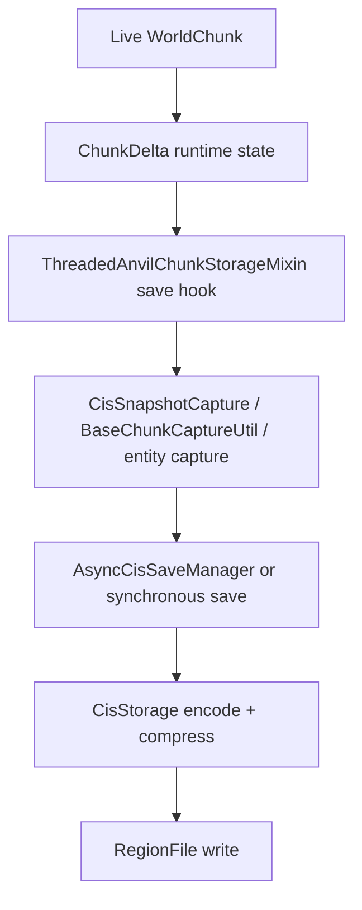
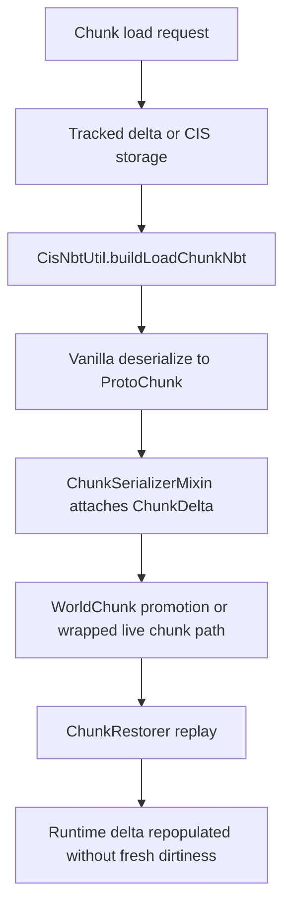

# System Overview

## Purpose

Chunkis replaces vanilla chunk persistence with a Chunkis-owned CIS pipeline. It does not just swap file formats. It owns:

- chunk mutation tracking
- save-time snapshot capture
- disk persistence
- synthetic load NBT generation
- restore-time replay
- client delta sync
- migration and debug tooling around that pipeline

## Modules

| Module | Responsibilities |
| --- | --- |
| `core/` | `ChunkDelta`, CIS codecs, region files, compression, mapping, debug event model |
| `fabric/` | Fabric entrypoints, mixins, runtime tracking, snapshot capture, restore, networking, commands, offline migration |
| `cismigrator/` | CIS version graph and storage-backed CIS-to-CIS migration |

## High-Level Runtime Flow

## Current Entry Points

- `ChunkisMod` registers payloads, commands, lifecycle hooks, shutdown flushing, and cleanup.
- `ClientChunkisMod` registers client networking and migration-status UI updates.
- `StoragePreventionMixin` blocks vanilla region I/O.
- `ThreadedAnvilChunkStorageMixin` owns the main save/load interception path.
- `ChunkSerializerMixin` attaches decoded Chunkis state during vanilla load conversion.
- `WorldChunkMixin` tracks live mutation and restores state into promoted chunks.
- `ChunkHolderMixin` piggybacks Chunkis client sync onto vanilla chunk packet sends.

## Core Invariants

- Once Chunkis persists a chunk, vanilla `.mca` I/O is not the authoritative path for that chunk state.
- `ChunkDelta` is the in-memory carrier for runtime state, persisted state, and restore metadata.
- Save-time persistence uses an authoritative snapshot, not the raw live sparse mutation shape.
- Sparse replay payloads without a usable anchor are rejected or repaired before persistence.
- Restore-time writes must not be re-recorded as fresh player mutation.

## Major Subsystems

- [Startup And Lifecycle](Startup-And-Lifecycle.md)
- [Delta And Ownership Model](Delta-And-Ownership-Model.md)
- [Save Pipeline](Save-Pipeline.md)
- [Load And Restore Pipeline](Load-And-Restore-Pipeline.md)
- [Storage Format](Storage-Format.md)
- [Networking And Client Sync](Networking-And-Client-Sync.md)
- [Migration And Versioning](Migration-And-Versioning.md)
- [Observability And Debugging](Observability-And-Debugging.md)
