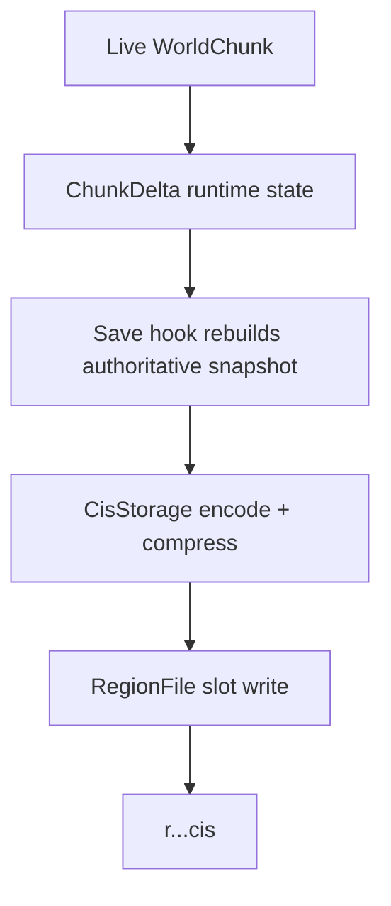
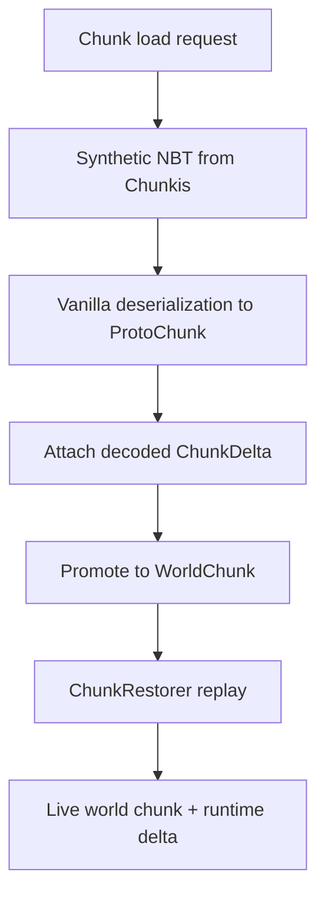

# System Overview

## Why Chunkis exists

Chunkis replaces vanilla chunk persistence with a CIS-based storage layer that keeps chunk data under Chunkis control instead of `.mca` files. The project exists to support Chunkis-specific persistence behavior, migration control, safer reload semantics, and debugging around chunk durability.

The important architectural point is that Chunkis is not "just a new file format". It owns the load path, the save path, the persistence metadata, and the restore rules.

## What the system does

- Tracks live chunk mutations in memory through `ChunkDelta`.
- Cancels vanilla region-file I/O through `StoragePreventionMixin`.
- Saves chunk state into CIS region files through `CisStorage` and `RegionFile`.
- Rebuilds vanilla load inputs from Chunkis state through `ThreadedAnvilChunkStorageMixin` and `ChunkSerializerMixin`.
- Restores decoded data into live `WorldChunk` instances through `ChunkRestorer` and `WorldChunkMixin`.
- Preserves durability anchors such as persisted base chunk NBT, structure metadata, and replay suppression metadata.
- Provides migration, debug tracing, storage inspection, and client delta sync.

## What the system does not do

- It does not coexist with vanilla `.mca` chunk persistence for the same chunk data.
- It does not guarantee smaller storage than vanilla in every world.
- It does not treat the live runtime delta as the exact persisted representation on the normal save path.
- It does not make gameplay or rendering faster by itself.

## Module layout

- `core/`
  Shared storage engine, encoding/decoding, mapping, region files, and debug event model.
- `fabric/`
  Minecraft/Fabric integration: mixins, world hooks, chunk tracking, restore, commands, networking, migration, and storage bootstrap.
- `cismigrator/`
  Version-to-version CIS migration logic used by the Fabric world migrator.

## High-level data flow

## Main integration points

- `ChunkisMod`: registers commands, lifecycle hooks, migration, scheduler ticks, and shutdown flushing.
- `StoragePreventionMixin`: blocks vanilla region reads/writes/sync.
- `ThreadedAnvilChunkStorageMixin`: injects the main save and synthetic-load logic.
- `ChunkSerializerMixin`: attaches decoded Chunkis state to proto chunks.
- `WorldChunkMixin`: captures live mutations and performs restore after proto promotion.
- `CommonChunkMixin`: attaches a `ChunkDelta` to every chunk and keeps vanilla dirty state aligned.

## Core invariants

- Vanilla chunk region I/O is cancelled. Chunkis is the authoritative persistence path.
- Every loaded/saved chunk carries a `ChunkDelta`, even if that delta is just an empty placeholder.
- A persisted replay payload must not rely on generated terrain unless a persistence anchor exists.
- Normal saves persist an authoritative snapshot, not just ad hoc sparse live edits.
- Restore-time writes must not be re-tracked as fresh player mutations.

## Common debugging locations

- Save path: `fabric/.../mixin/storage/ThreadedAnvilChunkStorageMixin.java`
- Load path: `fabric/.../mixin/storage/ChunkSerializerMixin.java`
- Restore path: `fabric/.../world/ChunkRestorer.java`
- Tracking: `fabric/.../world/GlobalChunkTracker.java`
- Storage: `core/.../storage/io/CisStorage.java`, `core/.../storage/io/RegionFile.java`

## Failure modes to keep in mind

- Save rejection because a sparse payload has no persisted base anchor.
- Decode or decompression failure causing a stored entry to be cleared.
- Dirty delta unloads or stale async completions creating durability suspicion.
- Portal metadata drifting from restored chunk contents if follow-up resync fails.

## See also

- [Delta And Ownership Model](C:/Users/Liparakis/Desktop/Chunkis/docs/Architecture/Delta-And-Ownership-Model.md)
- [Save Pipeline](C:/Users/Liparakis/Desktop/Chunkis/docs/Architecture/Save-Pipeline.md)
- [Load And Restore Pipeline](C:/Users/Liparakis/Desktop/Chunkis/docs/Architecture/Load-And-Restore-Pipeline.md)
- [Storage Format](C:/Users/Liparakis/Desktop/Chunkis/docs/Architecture/Storage-Format.md)
