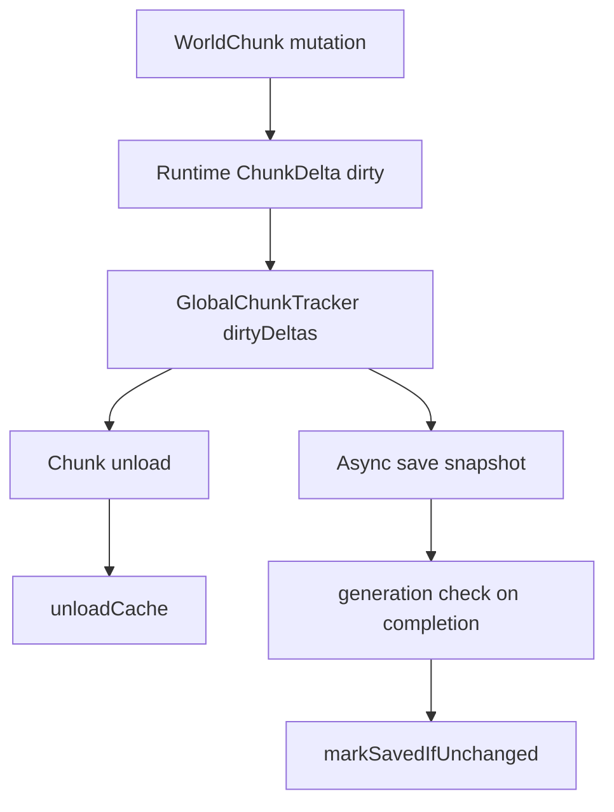

# Tracking, Guards, And Durability

## Problem this subsystem solves

Once Chunkis disables vanilla region storage, losing track of a dirty chunk is a real durability bug. The project therefore needs explicit ownership tracking, unload survivability, guard rails against unsafe payloads, and asynchronous-save generation checks.

## Responsibilities

- Track dirty chunk deltas across the world lifecycle.
- Keep recently unloaded deltas available long enough to service loads.
- Reject or repair unsafe sparse payloads.
- Prevent stale async completions from marking newer state clean.
- Provide the operational surface for durability investigation.

## What it does not do

- It does not prove persistence correctness from one event alone.
- It does not keep an infinite history of unloaded chunks.
- It does not make sparse payloads safe by wishful thinking; it either anchors them or rejects them.

## Owning classes

- `fabric/.../world/GlobalChunkTracker`
- `fabric/.../storage/DeltaPersistenceGuard`
- `fabric/.../storage/BaseChunkCaptureUtil`
- `fabric/.../storage/BaseChunkCaptureScheduler`
- `fabric/.../storage/AsyncCisSaveManager`
- `fabric/.../world/LeafTickContext`

## Tracker model

`GlobalChunkTracker` keeps two layers:

- `dirtyDeltas`
  authoritative currently tracked dirty deltas
- `unloadCache`
  bounded LRU cache of recently unloaded deltas

This lets the load path prefer newer in-memory state even after a chunk unload.

## Guard model

`DeltaPersistenceGuard` rejects replay payloads that have neither:

- persisted base chunk NBT
- full-block baseline metadata

The most explicit invalid shape is block-entity-only payload without a base.

## Async durability model

`AsyncCisSaveManager` snapshots the delta and remembers its generation.

On completion it only calls `GlobalChunkTracker.markSavedIfUnchanged(...)` if:

- the live delta instance is still the same one
- the generation still matches

That is the core anti-stale-write invariant.

## Natural mutation exceptions

`LeafTickContext` exists so natural leaf decay does not get mistaken for a meaningful tracked user edit. That is a narrow policy exception, not a general "ignore world changes" escape hatch.

## Data flow

## Invariants

- Dirty deltas must be registered with the tracker.
- Clean unload-cache entries are not authoritative and are invalidated on lookup.
- A stale async completion must never clean a newer generation.
- Unsafe sparse payloads must be rejected or upgraded with a base capture.

## Common debugging locations

- [GlobalChunkTracker.java](C:/Users/Liparakis/Desktop/Chunkis/fabric/src/main/java/io/liparakis/chunkis/world/GlobalChunkTracker.java)
- [DeltaPersistenceGuard.java](C:/Users/Liparakis/Desktop/Chunkis/fabric/src/main/java/io/liparakis/chunkis/storage/DeltaPersistenceGuard.java)
- [AsyncCisSaveManager.java](C:/Users/Liparakis/Desktop/Chunkis/fabric/src/main/java/io/liparakis/chunkis/storage/AsyncCisSaveManager.java)
- [BaseChunkCaptureScheduler.java](C:/Users/Liparakis/Desktop/Chunkis/fabric/src/main/java/io/liparakis/chunkis/storage/BaseChunkCaptureScheduler.java)
- [LeafTickContext.java](C:/Users/Liparakis/Desktop/Chunkis/fabric/src/main/java/io/liparakis/chunkis/world/LeafTickContext.java)

## Common failure modes

- dirty chunk unload with no confirmed save evidence
- tracker keeps a weaker incoming delta instead of the authoritative one
- sparse save rejected late because earlier base capture never happened
- shutdown path forced to flush too much queued work

## See also

- [Save Pipeline](C:/Users/Liparakis/Desktop/Chunkis/docs/Architecture/Save-Pipeline.md)
- [Load And Restore Pipeline](C:/Users/Liparakis/Desktop/Chunkis/docs/Architecture/Load-And-Restore-Pipeline.md)
- [Observability And Debugging](C:/Users/Liparakis/Desktop/Chunkis/docs/Architecture/Observability-And-Debugging.md)
